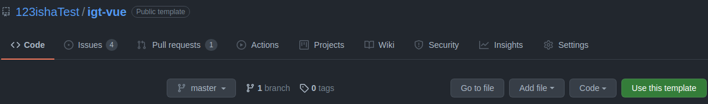
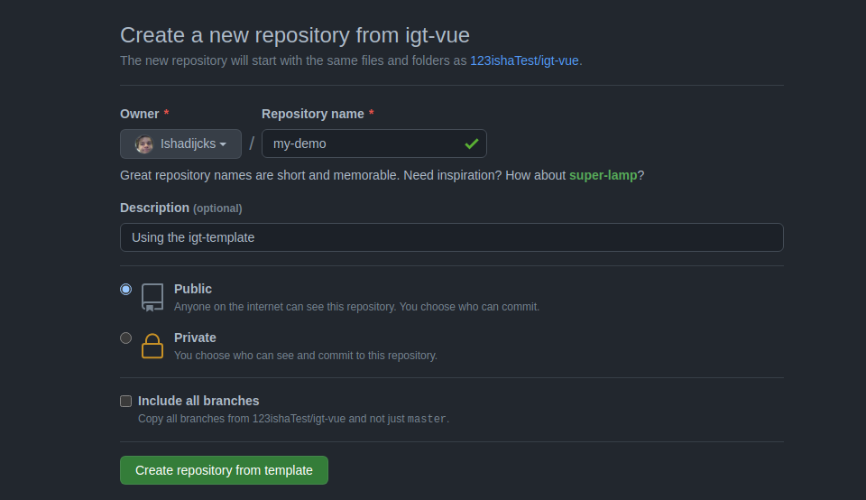

First we need to use the template by pressing the big green button


Select the organization to create the repository in, and give it a proper name


This should redirect you to a URL like https://github.com/123ishaTest/igt-demo

## Cloning the repository
:::tip
Any decent editor (VSCode or Webstorm) can simplify this step for you.
:::

Navigate to the folder you want to clone the project in, and clone the repository with git
```bash
git clone https://github.com/123ishaTest/igt-demo
```

## Running it locally
Open a terminal in your local repository, and install the dependencies with
```bash
npm install
```
When that is finished, run the Vue application with
```bash
npm run serve
```

Go to the URL http://localhost:8080/ in your favourite browser, and you should see a big red Reset Save button, this means it is working!

Now open this project in your favorite editor and let's see what we're working with!
