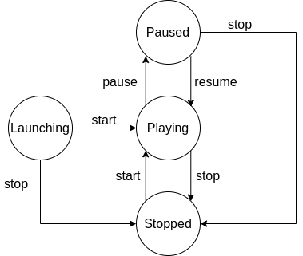

The game accepts 4 possible states, and 4 transition methods that are shown in the following diagram.


```ts
export enum GameState {
    Launching = "Launching",
    Playing = "Playing",
    Paused = "Paused",
    Stopped = "Stopped",
}
```

## See also
- [src/ig-template/Game.ts](https://github.com/123ishaTest/igt-library/blob/master/src/ig-template/Game.ts)
- [src/ig-template/GameStates.ts](https://github.com/123ishaTest/igt-library/blob/master/src/ig-template/GameState.ts)
